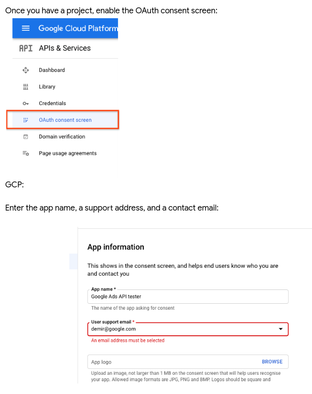
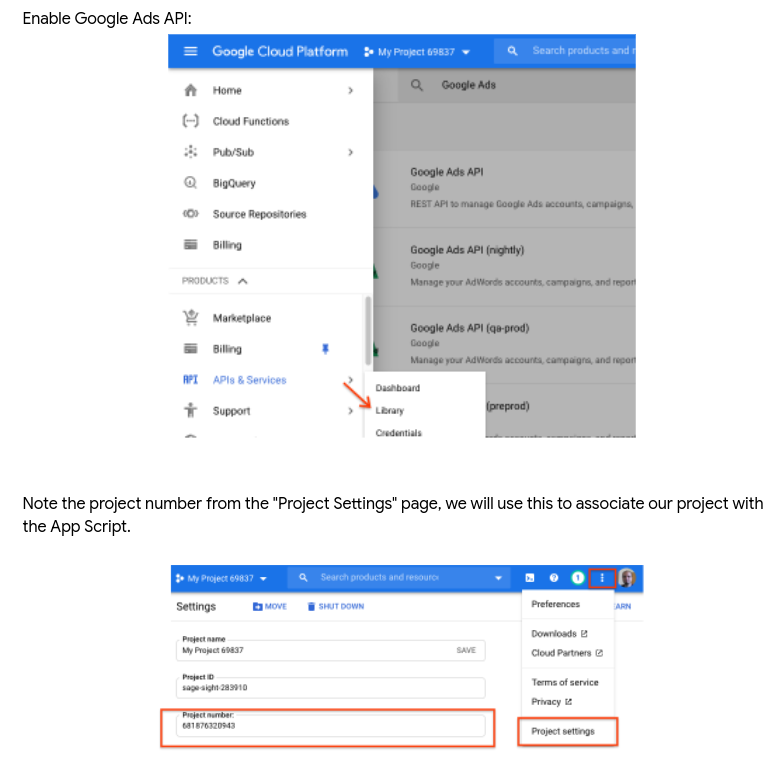
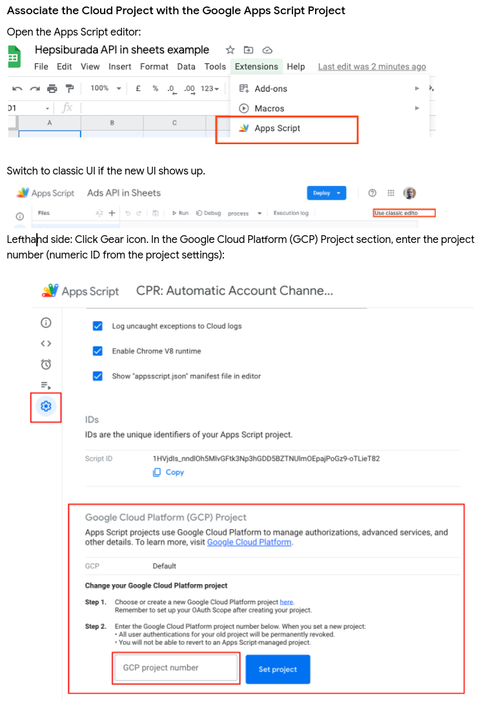
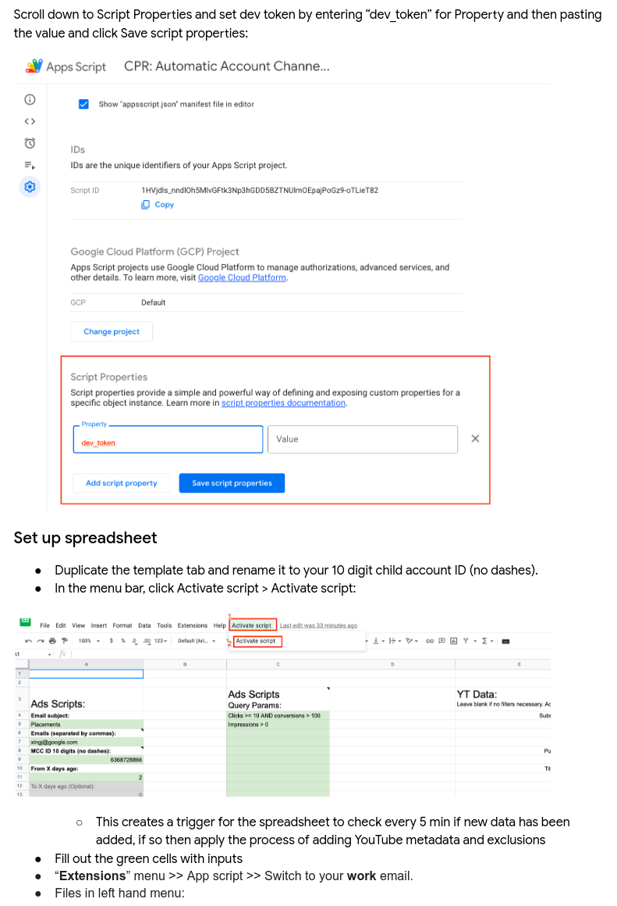
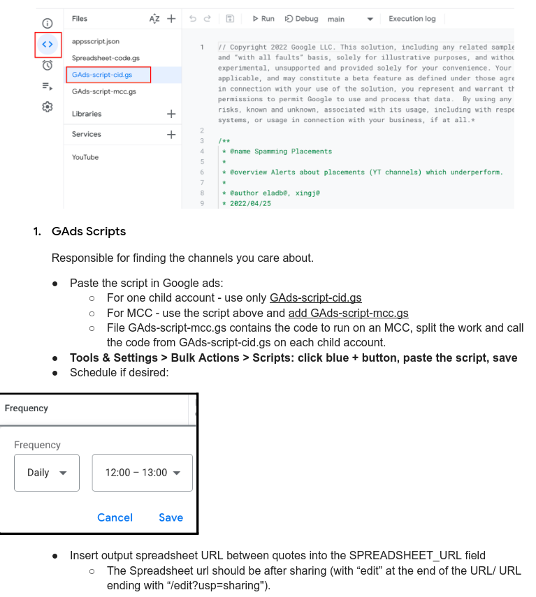
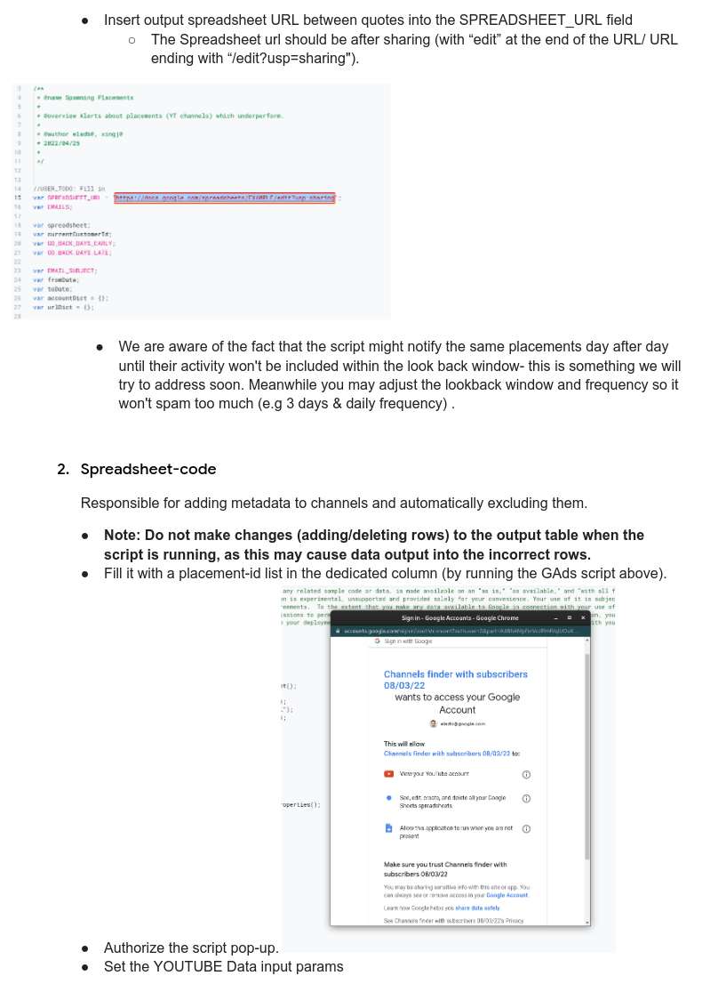
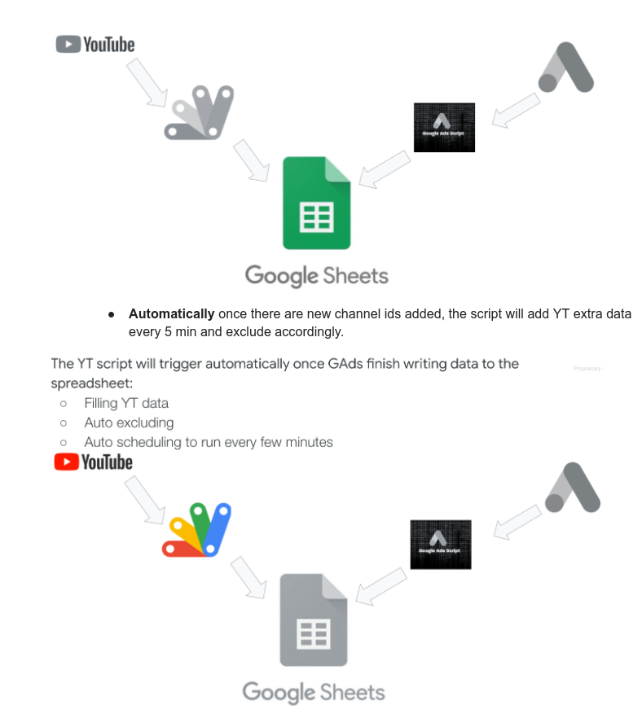

# Channel Placement Excluder

## Project owners
- rsela@google.com
- tal@google.com
- dvirka@google.com

Dev: 
- eladb@google.com
- xingj@google.com
- bsidebottom@google.com 

## Problem Statement

From time to time, advertisers may want to stop advertising on YT channels which underperform  and take a noticeable portion of their budget. 

## Solution

An apps script solution which filters YT channel placements according to historic data, then augment it with metadata YT API and finally calls Google Ads API via REST to exclude the relevant channels at the account level. This solution aims to quickly exclude poor performing channels from their entire account regularly. Allowing advertiser to focus their budget to more yielding and fruitful YT channels.
It can be run periodically and fully automatically or on-demand calls to the APIs.

## Deliverable (Implementation)

A spreadsheet with apps-script code that lists all the YT channels to be excluded or were automatically/on-demand excluded.

## Deployment

### Prerequisites

* Google cloud project

Create/own a Cloud Project
If you already have a GCP console for Ads API, you can use it.  Otherwise, create a new one following the directions at this [website](https://developers.google.com/google-ads/api/docs/first-call/oauth-cloud-project).

### Installation

* [Full user guide](https://docs.google.com/document/d/1NJWg1qfvxRiELdXGURPBgYUyPwdk26Nuxnxjf4k1EkY/edit?usp=sharing)

#### Create a containing document
Create a copy of the [spreadsheet](https://docs.google.com/spreadsheets/d/1LOIr41kw7oSCRTLanWK6rb5cguHFWzns4pIP3ix32EE/copy)

#### Secure the Ads API Dev Token
You'll need a Dev token for calling the Ads API. Follow the directions [here](https://developers.google.com/google-ads/api/docs/first-call/dev-token).

Once you have a project, enable the OAuth consent screen:

Enable Google Ads API:

Associate the Cloud Project with the Google Apps Script Project
Open the Apps Script editor:

Scroll down to Script Properties and set dev token by entering “dev_token” for Property and then pasting the value and click Save script properties: 

### Usage

In the spreadsheet:

Duplicate the template tab and rename it to your 10 digit child account ID (no dashes). 

In the menu bar, click Activate script -> Activate script:

The spreadsheet-code is responsible for adding metadata to channels and automatically excluding them.

Note: Do not make changes (adding/deleting rows) to the output table when the script is running, as this may cause data output into the incorrect rows.
Fill it with a placement-id list in the dedicated column (by running the GAds script above). 

## Disclaimer

This is not an officially supported Google product.
Copyright 2022 Google LLC. This solution, including any related sample code or data, is made available on an “as is,” “as available,” and “with all faults” basis, solely for illustrative purposes, and without warranty or representation of any kind. This solution is experimental, unsupported and provided solely for your convenience. Your use of it is subject to your agreements with Google, as applicable, and may constitute a beta feature as defined under those agreements.  To the extent that you make any data available to Google in connection with your use of the solution, you represent and warrant that you have all necessary and appropriate rights, consents and permissions to permit Google to use and process that data.  By using any portion of this solution, you acknowledge, assume and accept all risks, known and unknown, associated with its usage, including with respect to your deployment of any portion of this solution in your systems, or usage in connection with your business, if at all.

 

## License
Apache Version 2.0
See [LICENSE](LICENSE)